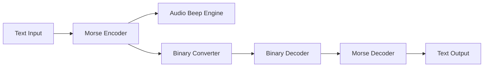

<div align="center">

# ⚡ MORSE TRANSMITTER

### A Morse Code Communication Toolkit


<br>


</div>

---

# Terminal Preview

```bash
=================================================
         MORSE TRANSMITTER v1.0
=================================================

[A] MORSE MODE
[B] BINARY MODE

> A

ENTER TEXT:
HELLO WORLD

.... . .-.. .-.. --- | .-- --- .-. .-.. -..
```

---

# Features

```diff
+ Text → Morse Translation
+ Morse → Text Translation
+ Real Audio Transmission (Beep)
+ Morse → Binary Conversion
+ Binary → Morse Restoration
+ Supports A-Z and 0-9
+ Word Separation
```

---

# Screenshots

### Terminal Interface

```text
┌───────────────────────────────────────┐
│ MORSE TRANSMITTER                     │
├───────────────────────────────────────┤
│ Input  : HELLO                        │
│ Output : .... . .-.. .-.. ---         │
└───────────────────────────────────────┘
```

### Binary Conversion

```text
HELLO

↓ Morse

.... . .-.. .-.. ---

↓ Binary

0000 0 0100 0100 111
```

---

# Architecture



---

# Installation

```bash
git clone https://github.com/Rwin-X/Morse-Transmitter.git

cd Morse-Transmitter

python morse_REAL.py
```

---

# Project Structure

```bash
Morse-Transmitter
│
├── morse_REAL.py
│
├── README.md

---

# Example Usage

## Text → Morse

```text
Input:
CYBER

Output:
-.-. -.-- -... . .-.
```

---

## Morse → Text

```text
Input:
-.-. -.-- -... . .-.

Output:
cyber
```

---

## Morse → Binary

```text
Input:
.-

Output:
01
```

---

# Supported Characters

| Character | Morse |
|-----------|--------|
| A | .- |
| B | -... |
| C | -.-. |
| D | -.. |
| E | . |
| F | ..-. |
| G | --. |
| H | .... |
| I | .. |
| J | .--- |
| K | -.- |
| L | .-.. |
| M | -- |
| N | -. |
| O | --- |
| P | .--. |
| Q | --.- |
| R | .-. |
| S | ... |
| T | - |
| U | ..- |
| V | ...- |
| W | .-- |
| X | -..- |
| Y | -.-- |
| Z | --.. |

---

# Tech Stack

<div align="center">


</div>

---

# GitHub Statistics

<div align="center">


</div>

---

# Contribution

```bash
Fork
 └── Create Branch
      └── Commit Changes
           └── Push
                └── Pull Request
```

---

# Author

```yaml
Name: Rwin-X
Field: text to morse
Language: Python

```
---

# License

MIT License

---

<div align="center">

```text
01000100 01001001 01010011 01000011 01001001 01010000 01001100 01001001 01001110 01000101

OR

01000100 01000101 01000001 01010100 01001000
```

⭐ Star the repository if you like it.

</div>
